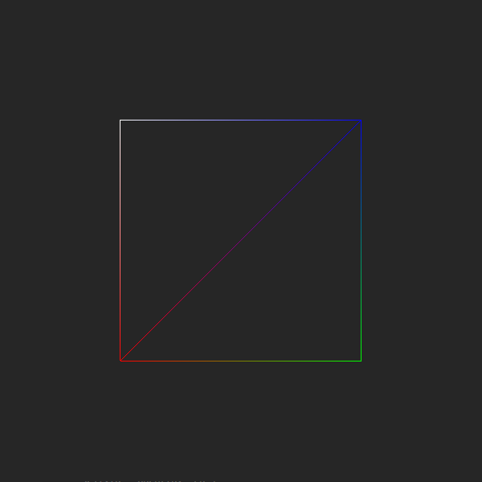
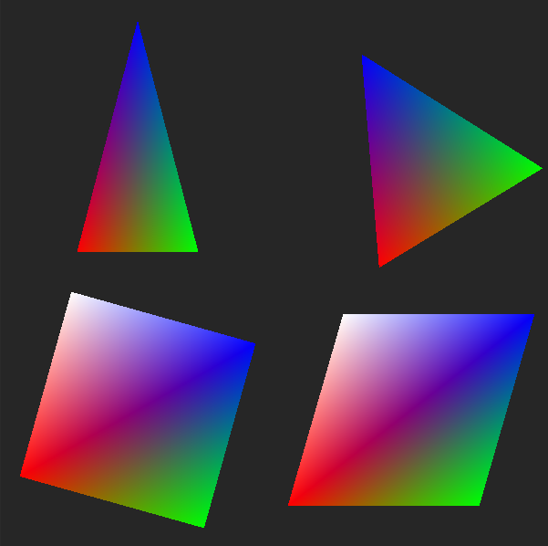
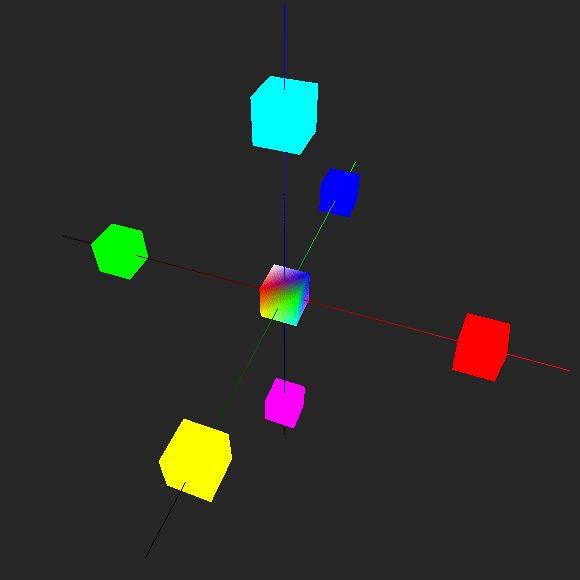
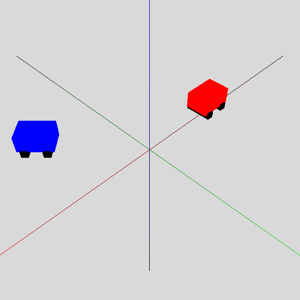
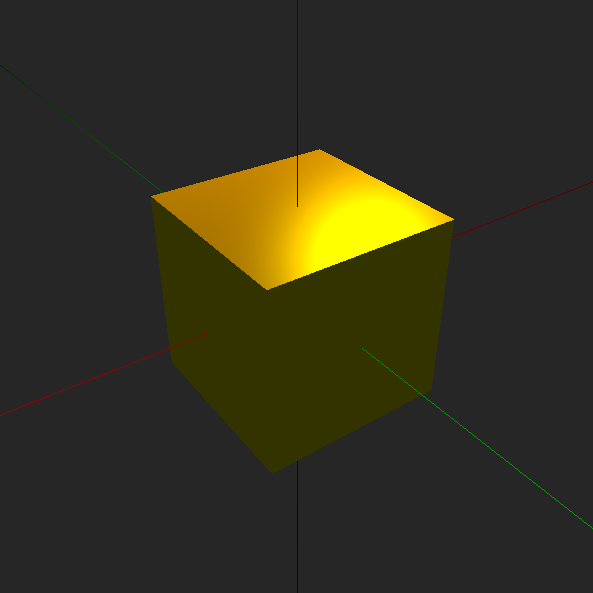
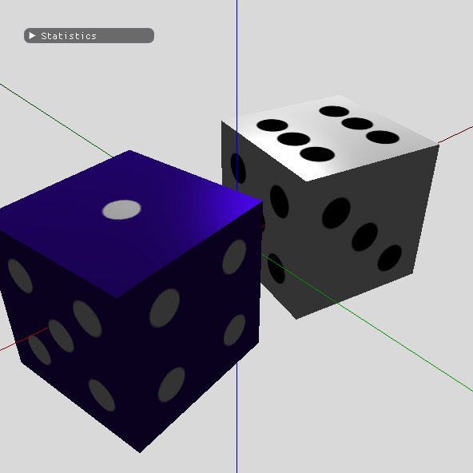

# Computer Graphics with OpenGL and C++

This repository tries to emulate https://github.com/dantros/grafica but using C++ instead of Python.
The aim is to speed up the usage of OpenGL in C++ for people who already followed the Python version.

## ex_quad_pro.cpp

## ex_4shapes.cpp

## ex_joystick.cpp

## ex_texture_boo.cpp

## ex_projections.cpp

## ex_scene_graph_3d.cpp

## ex_lighting.cpp

## ex_lighting_texture.cpp

